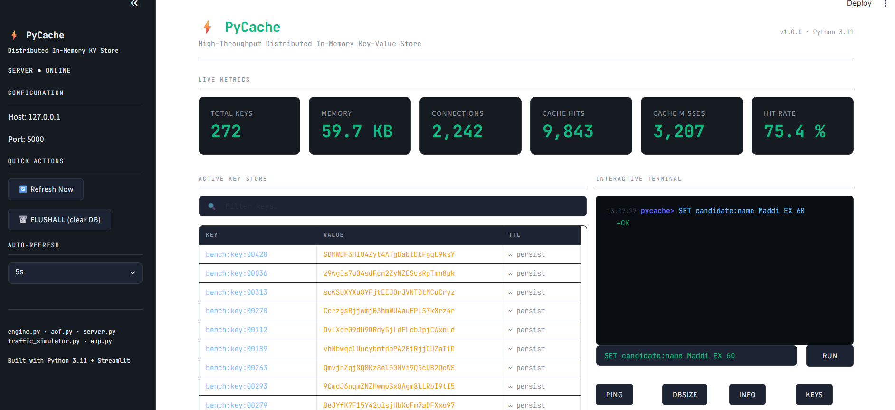
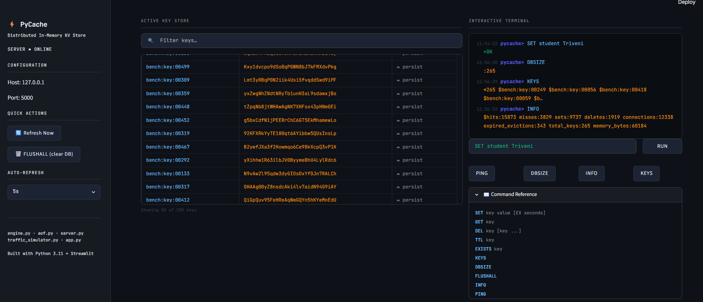
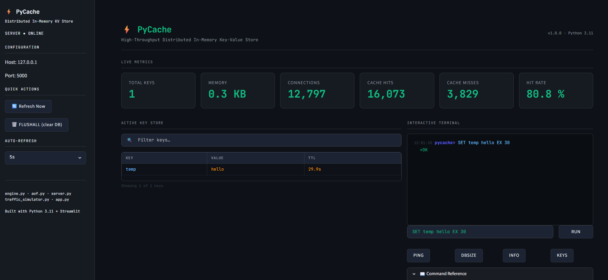
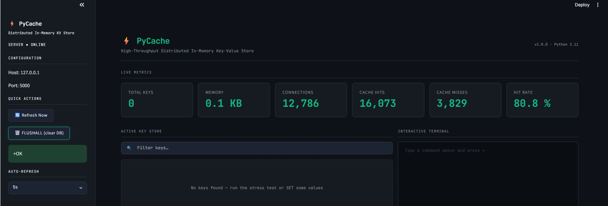

# ⚡ PyCache

A high-performance distributed in-memory key-value store inspired by Redis, built using Python. PyCache provides fast data storage and retrieval, TTL (Time-To-Live) support, persistence through Append-Only Files (AOF), real-time monitoring, and an interactive dashboard powered by Streamlit.

---

## 🚀 Features

* Fast in-memory key-value storage
* Redis-inspired command execution
* TTL (Time-To-Live) support
* Append-Only File (AOF) persistence
* Real-time monitoring dashboard
* Cache hit and miss tracking
* Memory usage statistics
* Active connection monitoring
* Interactive command terminal
* Database management operations

---

## 🏗️ System Architecture

```text
User
  │
  ▼
PyCache Dashboard (Streamlit)
          │
          ▼
TCP Socket Server (server.py)
          │
          ▼
Storage Engine (engine.py)
          │
          ▼
AOF Persistence Layer (aof.py)
```

---

## 📸 Dashboard Overview

The dashboard provides a real-time overview of the key-value store, including memory usage, cache hit rate, active connections, total keys, cache hits, and cache misses.



---

## 💾 Database Operations

Users can execute Redis-inspired commands directly from the interactive terminal. Supported operations include SET, GET, KEYS, DBSIZE, INFO, and more.



---

## ⏳ TTL (Time-To-Live) Support

PyCache supports automatic key expiration using TTL. Keys can be created with expiration times and are automatically removed once they expire.

Example:

```text
SET temp hello EX 30
```



---

## 🗑️ Database Reset (FLUSHALL)

The FLUSHALL command clears the entire database while keeping the server online and operational.



---

## 📂 Project Structure

```text
pycache/
│
├── aof.py
├── app.py
├── engine.py
├── server.py
├── traffic_simulator.py
├── requirements.txt
│
├── dashboard-overview.png
├── database-operations.png
├── ttl-demo.png
├── flushall-demo.png
│
└── README.md
```

---

## 🛠️ Supported Commands

| Command       | Description            |
| ------------- | ---------------------- |
| SET key value | Store a key-value pair |
| GET key       | Retrieve value         |
| DEL key       | Delete key             |
| EXISTS key    | Check if key exists    |
| TTL key       | View expiration time   |
| KEYS          | List all keys          |
| DBSIZE        | Display database size  |
| INFO          | Show server statistics |
| PING          | Check server status    |
| FLUSHALL      | Clear database         |

---

## ⚙️ Installation

```bash
git clone https://github.com/MaddiboinaTriveni/pycache.git
cd pycache
pip install -r requirements.txt
```

---

## ▶️ Running the Project

Start the backend server:

```bash
python server.py
```

Open another terminal and run:

```bash
streamlit run app.py
```

Access the dashboard:

```text
http://localhost:8501
```

---

## 🧪 Tech Stack

* Python
* Streamlit
* Socket Programming
* Multithreading
* AOF Persistence
* In-Memory Data Structures

---

## 🎯 Learning Outcomes

* Database Internals
* Client-Server Architecture
* Socket Programming
* Caching Systems
* Persistence Mechanisms
* Dashboard Development
* System Design Concepts

---

## 👩‍💻 Author

**Triveni Maddiboina**

B.Tech Computer Science Engineering Student | Python Developer | Software Engineering Enthusiast

⭐ If you found this project useful, consider giving it a star.
